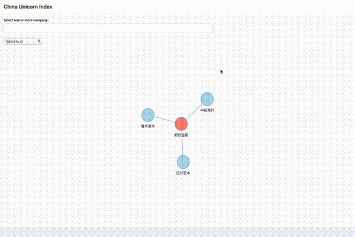

Language: **[ENG](README.md) 🇬🇧 | [中文](README_zh.md)** 🇨🇳

# China Unicorn Index

```
#R #Shiny #Neo4j #Docker
```



## Background

An application built on `R` + `Shiny` which integrates with `Neo4j` graph database and shipped in `Docker`. Data is extracted from Hurun Report
([English](https://www.hurun.net/EN/HuList/Unilist?num=ZUDO23612EaU) |
[Chinese](http://www.hurun.net/CN/HuList/Unilist?num=ZUDO23612EaU)),
which published an index of China unicorns (company with more than 10 billions in valuation).

The purpose of this exercise is to provide a demonstration of **connecting R to graph database**, and **packaging exploratory tool into a viable data product**.

## Setup

#### Build Docker Image

```bash
git clone https://github.com/bj-sodas/china-unicorn-index.git
cd china-unicorn-index
## Note: Replace CRAN mirror url (https://cran.r-project.org/mirrors.html) with the one that is closest to you. ---
docker build -t china-unicorn-index .
```

Or pull image from Github package registry

```bash
docker pull docker.pkg.github.com/bj-sodas/china-unicorn-index/china-unicorn-index:latest
```

#### Configuration

We are required to create a config file named `config.yml` in your directory. It is used for Shiny app to locate Neo4j database and authentication information. A [sample](config.yml.sample) is provided in this repository.

```yaml
default:
    title:      # Something that displays on application title bar
    url:        # Neo4j database and port e.g http://172.30.10.9:7474
    username:   # Neo4j username
    password:   # Neo4j password
    inode:      # Initial node to display
```

## Running Application

The following provides 2 methods to run the application. Recommended way of doing it is through `docker-compose` ([method I](#i-run-app--with-docker-compose-)) as services are defined for you. Otherwise, you can choose to run the application separately ([method II](#ii-run-app--from-local-runapp-)).

#### (I) Run App ( with `Docker Compose` )

We will [define](docker-compose.yml) and run 2 services, one for our Neo4j database (named `neo4j-db`) and one for our Shiny app (named `webapp`).

First we extract the database snapshot to `Graph` folder so that data can be pre-populated.

```bash
tar -xvzf graph.data.tar.gz -C Graph
```

Then we specify the configuration as the following,

```yaml
default:
    title: China Unicorn Index
    url: http://neo4j-db:7474 # docker will resolve address of neo4j
    username: neo4j
    password: somepassword
    inode: Ant Financial
```

On command line run

```bash
# make sure you are in 'china-unicorn-index' base directory
docker-compose up -d
```

Open your web browser and locate http://localhost:33838/china-unicorn-index.

#### (II) Run App ( from local `runApp` )

Start a [Neo4j Docker](https://hub.docker.com/_/neo4j) (named **neo4j-db**) container with the following options,

* ports 7474 (HTTP) and 7687 (Bolt) exposed;
* binds the import directory (so that we can import data through csv files);
* create username (**neo4j**) and password (**somepassword**) for authentication;

```bash
# make sure you are in 'china-unicorn-index' base directory
docker run \
    --name neo4j-db \
    -p7474:7474 -p7687:7687 \
    -d \
    -v $PWD/import:/var/lib/neo4j/import \
    --env NEO4J_AUTH=neo4j/somepassword \
    neo4j:3.4.0
```

With Docker up and running, we import our data by passing [queries](Graph/setup.cql) through `bin/cypher-shell`.

```bash
cat Graph/setup.cql |  docker exec --interactive neo4j-db bin/cypher-shell -u neo4j -p somepassword
```

Database is ready. Here we specify the configuration as the following,

```yaml
default:
    title: China Unicorn Index
    url: http://127.0.0.1:7474 # neo4j is exposed to localhost
    username: neo4j
    password: somepassword
    inode: Ant Financial
```

Run the application in `RStudio`, or on command line run

```bash
R -e 'shiny::runApp(host="127.0.0.1", port=33838)'
```
*Note: You must have required packages installed in your local station.*

Open your web browser and locate http://localhost:33838.

#### FAQ

My application cannot start. It says `An error has occurred. Check your logs or contact the app author for clarification`.

* Check your config file. Have you declared your url correctly?
* Give `neo4j` some time to start up, and refresh your browser.
